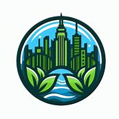

# Ending the bootcamp - Microsoft Copilot

This document outlines a business idea for s
tarting a cleaning company in New York City that specializes in cleaning offices and commercial premises. Here are the key points:

### Business Concept
- *Specialization*: Cleaning offices and commercial premises.
- *Eco-Friendly*: Use of eco-friendly cleaning materials.
- *Local Employment*: Employing local contractors and providing them with cleaning equipment.
- *Startup Costs*: Initial budget of $10,000 for equipment, materials, and marketing.
### Market Analysis
- *Growing Market*: Increasing demand for green cleaning products, with the global market expected to grow by 8.4% annually until 2027.
- *Community Benefits*:
  - Hiring local contractors, saving on transportation, and building customer loyalty.
  - Creating jobs and income for the local community.
- *Competitive Edge*:
  - Offering customized and flexible cleaning solutions.
  - Catering to both eco-friendly and quality-seeking customers.
  - Creating social and economic value in the local area.
  This business idea aims to tap into the growing market for eco-friendly cleaning products while also benefiting the local community through job creation and economic development.

Setting up a business in New York involves several key steps. Here’s a general overview to get you started:

### 1. Choose a Business Structure:

- *Sole Proprietorship*: Simple to set up, but you are personally liable for business debts.
- *Partnership*: Involves two or more people sharing profits, losses, and liabilities.
- *Corporation*: More complex, offering liability protection but with more regulations.
- *Limited Liability Company (LLC)*: Combines the benefits of a corporation and partnership.
### 2. Register Your Business:
- *Sole Proprietorships and General Partnerships*: File in the county where they’re located.
- *Corporations*: File a Certificate of Incorporation with the Department of State.
- *LLCs*: File Articles of Organization with the Department of State1.
### 3. Get Your Federal Tax ID (EIN):
- Apply for an Employer Identification Number (EIN) through the IRS website.
### 4. Register for State Taxes:
- Apply to the NYS Department of Taxation and Finance for a sales tax Certificate of Authority if you plan to sell goods or services subject to sales tax1.
### 5.Obtain Necessary Licenses and Permits:
Use the NY License Center to find and apply for the required licenses and permits1.
### 6. Insurance:
- *Required Insurance*: Unemployment Insurance, Workers’ Compensation.
- *Optional Insurance*: Disability Insurance, health insurance depending on your business structure and employees1.
### 7. Get Support and Resources:
- *NYS Small Business Development Center*: Offers free counseling, business planning, and training.
- *NYS Empire State Development*: Provides technical and small business assistance, loan options, grants, and tax credits1.
### 8. Market Research and Planning:
- Use tools like SizeUp from the Small Business Administration to map competition and benchmark performance.
- Research local tax rates and compare wages across the state1.
Starting a business can be a complex process, but there are many resources available to help you along the way.

--- 
> Attachments
> 
> 
> 
> 
> [Apresentação do PowerPoint.pdf](output%2FApresenta%C3%A7%C3%A3o%20do%20PowerPoint.pdf)
> [Business Idea.pdf](output%2FBusiness%20Idea.pdf)
> 
---

